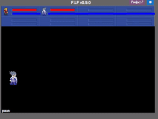

# Deep Reinforcement Learning for Playing 2.5D Fighting Games
Official Tensorflow implemenation of the paper. we create an OpenAI-gym-like gaming environment with the game of Little Fighter 2 (LF2), and present a novel A3C+ network for learning RL agents based on A3C. The introduced model includes a Recurrent Info network, which utilizes game-related info features with recurrent layers to observe combo skills for fighting.

## Demo

Our agent plays **Firen (red)** against Freeze (blue).



For the enviromnent of LF2 Gym, please refer [here](https://github.com/elvisyjlin/lf2gym).

## Paper
Deep Reinforcement Learning for Playing 2.5D Fighting Games<br>
[Hsin-Yu Chang](https://github.com/acht7111020)\*, [Yu-Jhe Li](https://github.com/YuJheLi)\*, [Yu-Jing Lin](https://github.com/elvisyjlin), [Po-Wei Wu](https://github.com/willylulu) and [Yu-Chiang Frank Wang](http://vllab.ee.ntu.edu.tw/members.html). <br>
IEEE International Conference on Image Processing (ICIP), 2018 (* equal contribution)<br>
[[arxiv]](https://arxiv.org/abs/1805.02070)

## Citing
If you find the work is useful in your research, please consider citing:
```
@inproceedings{li2018deep
  title={Deep Reinforcement Learning for Playing 2.5 D Fighting Games},
  author={Li, Yu-Jhe and Chang, Hsin-Yu and Lin, Yu-Jing and Wu, Po-Wei and FrankWang, Yu-Chiang},
  booktitle={2018 25th IEEE International Conference on Image Processing (ICIP)}
  year={2018}
}
```

## Usage

### Requirements
1. Python 3.4 or higher
2. TensorFlow 1.3.0

Download the Web Drivers
1. PhantomJS - http://phantomjs.org/download.html
2. ChromeDriver - https://sites.google.com/a/chromium.org/chromedriver/
3. GeckoDriver (Firefox) - https://github.com/mozilla/geckodriver/releases

Installing PhantomJS in Ubuntu: https://gist.github.com/julionc/7476620

### Setup LF2 GYM
1. Clone the env first
```
git clone https://github.com/elvisyjlin/lf2gym.git
```

2. Put `a3c*.py` in this repo beside the file `lf2gym.py`

### Train an agent
1. Start a LF2Server first. For more information, please refer [here](https://github.com/elvisyjlin/lf2gym#to-start).
2. ```python a3c.py --train --savepath [/path/to/your/model]```

### Test with the pre-trained model
1. Download the models from [coming soon!]()
2. ```python a3c.py --test --loadpath [/path/to/your/model]```
3. It would save 10 testing video clips under the current working directory

Example:

```python
env = lf2gym.make(startServer=True, autoStart=True, rewardList=['hp'], characters=[Character.Firen, Character.Davis],
    url='http://127.0.0.1:[YOURPORT]', serverPort=[YOURPORT])
```

### Control and play with pre-trained agent
1. ```python a3c_play.py --loadpath [/path/to/your/model]```
2. Chrome browser will be opened and have fun with it!

Keyboard control setting is described [here](https://github.com/elvisyjlin/lf2gym#keyboard-control).

### Modifications to original game

In order to train the agent better, we remove the background of 'HK Coliseum' and the image of 'pause'.
The frame rate is also raised to 180fps.

# Reference

1. [Project F](https://github.com/Project-F).
2. [OpenAI Gym](https://gym.openai.com/docs/).

Code inspired from:
1. https://github.com/coreylynch/async-rl
2. https://medium.com/emergent-future/simple-reinforcement-learning-with-tensorflow-part-8-asynchronous-actor-critic-agents-a3c-c88f72a5e9f2
3. https://github.com/papoudakis/a3c-tensorflow

